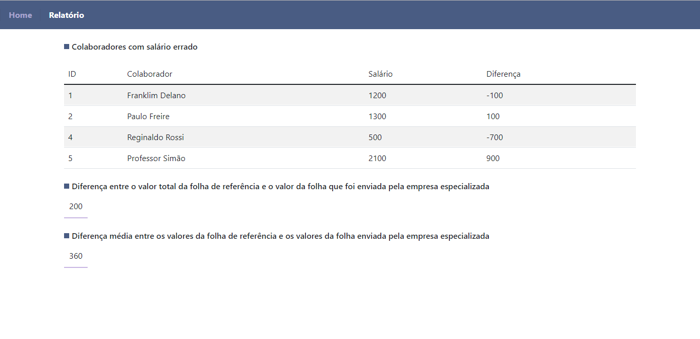

<h1 align="center">
    Exibição de uma página relatório
</h1>

## 🖥️ Projeto

Página web para exibição do relatório sobre os salários dos colaboradores. O front-end foi densevolvido em Vue.js e o backend em Laravel 9.

## 📰 Screenshots

<div align="center">
  
</div>

## ⛏️Tecnologias

- [PHP Laravel 9](https://laravel.com/docs/9.0) 
- [Vue.js](https://vuejs.org/guide/introduction.html)

## 💿Executado o projeto

Para executar o projeto é necessário anter ter instalado em sua máquina o [Nodejs](https://nodejs.org/en/), 
o gerenciador de pacotes [npmjs](https://www.npmjs.com/) e o [Composer](https://getcomposer.org/download/)

```bash

# Clone este repositório
$ git clone <https://github.com/ezequias21/app.git>

# Acesse a pasta do projeto no terminal/cmd
$ cd app

# Acesse o backend
$ cd app

# Instale as dependências
$ composer install 

#Inicie o servidor
$ php artisan serve

# O servidor inciará na porta 8000 - acesse <http://localhost:8000>
# --------------------------------------------------------------
# Agora incie o front-end, a partir da raiz do projeto, faça

$ cd frontend
$ npm install
$ npm run dev

# A aplicação irá iniciar em <http://localhost:3000>
# Para ver o relatório acesse <http://localhost:3000/relatorio>
# Ou clique em Relatório no menu do topo da página em <http://localhost:3000>
```
